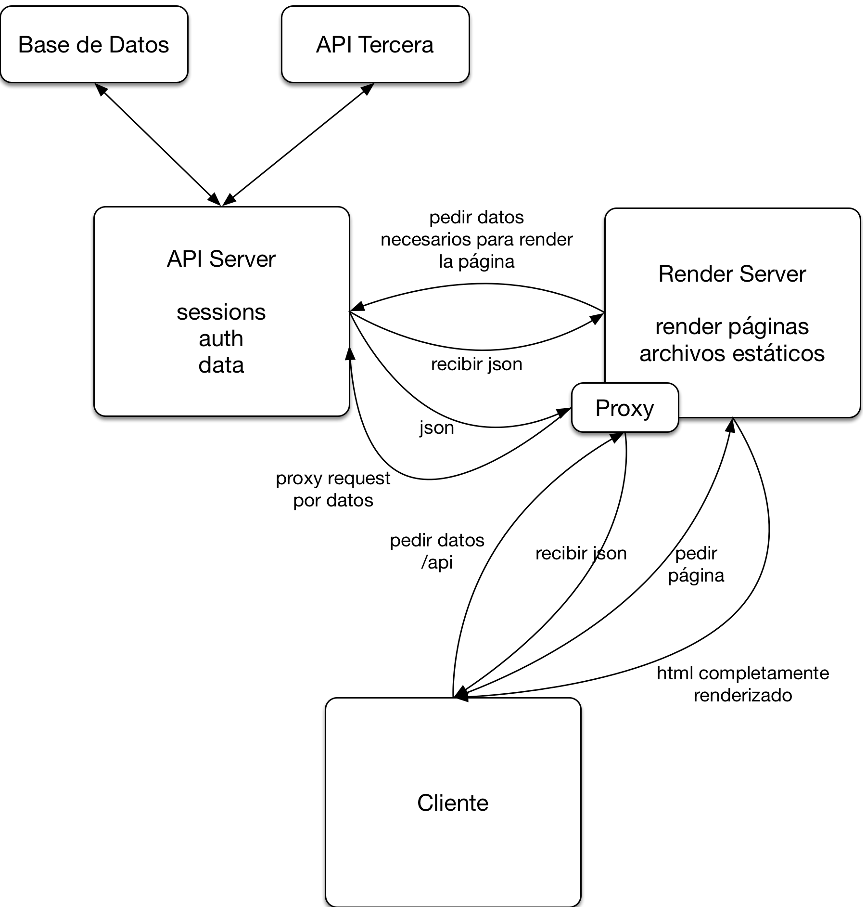

# Server-Side Rendering con Next.js

## Lemon Coders - 2 de Mayo de 2018

## Erik Rasmussen – [@erikras](https://twitter.com/erikras)

## Enlaces

* [Next.js](https://nextjs.org)
* [Styled Components](https://www.styled-components.com)
* [Next.js SSR with Styled Components](https://github.com/zeit/next.js/tree/master/examples/with-styled-components)
* [Next.js SSR with Redux](https://github.com/zeit/next.js/tree/master/examples/with-redux)

## Flujo

